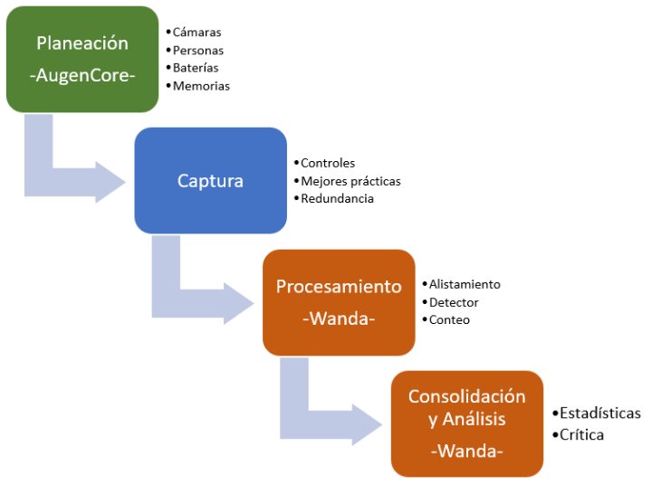
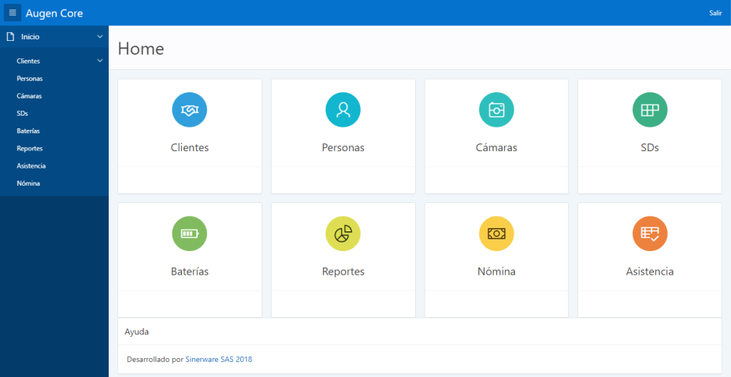
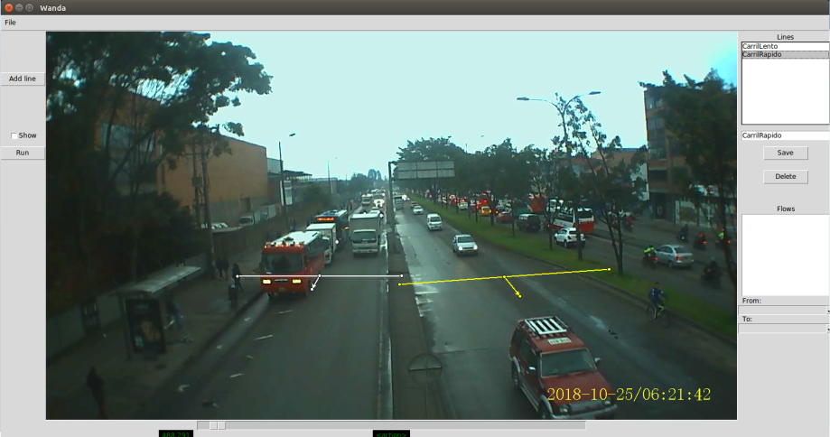
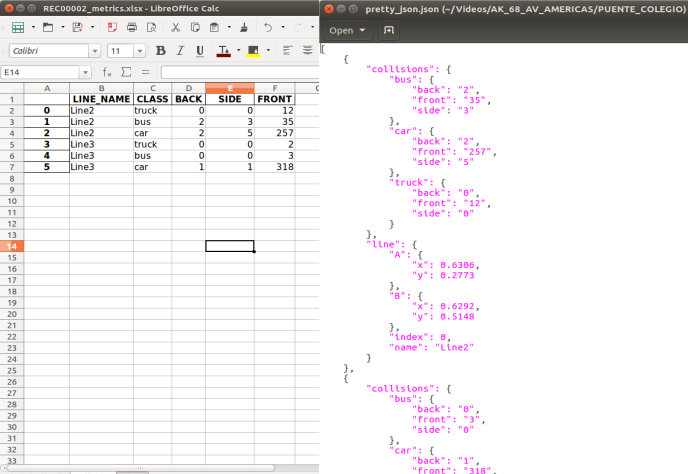

# Problema
La planeación de la movilidad requiere de datos sobre el tránsito que actualmente se obtienen en gran medida por métodos manuales. En particular, hemos identificado en el conteo de vehículos de forma manual 4 pasos principales:
1. Planeación 
1. Toma de información
1. Generación de datos
1. Análisis de resultados

Sin embargo, las fuentes de estos datos son cada vez de mayor volumen, más veloces y variables, y los métodos manuales presentan algunas dificultades.

## Aspectos por mejorar del método manual

| No. | Img | Problema | Detalle |
| --- | --- |--- | --- |
| 1. |  | **Complejidad de la logística** | El método manual de conteo vehicular requiere de muchas personas, introduciendo una gran variabilidad que se hace difícil de gestionar, desde la planeación del conteo, pasando por lo administrativo, lo legal y hasta el pago. |
| 2. | | **Error humano** | El conteo manual, realizado viendo videos o directamente en campo, introduce un margen de error por factores como la distracción, el cansancio, las motivaciones personales, etc. |
| 3. | | **Tiempo** | Los pasos manuales producen que la toma y consolidación de información tarde un tiempo sustancial. |
| 4. | | **Costo** | El número de personas y pasos involucrados, repercuten en el costo de la obtención de información. |

Lo anterior concluye en un problema de calidad, pero por fortuna tenemos una propuesta para que sea subsanado con tecnología e innovación.

# Wanda como solución
Es un servicio de conteo vehicular automatizado  que usa inteligencia artificial para aumentar la calidad del conteo y facilitar la logística en los puntos de toma de información.

## Proceso

### Planeación: 
AugenCore es un sistema que integra el proceso de punta a punta, desde la planeación y la toma de datos, hasta la entrega de resultados al cliente.

### Captura:
Los videos capturados en campo son la fuente para que realicemos el procesamiento de los mismos y de manera automatizada produzcamos los resultados. Innovamos en la captura con algunos atributos de calidad:

* 50 horas continuas de video
* Almacenamiento eficiente
* Autonomía
* Montaje robusto
* Confiabilidad

### Procesamiento:
El éxito de Wanda está en su capacidad para procesar videos de tránsito y producir resultados de la calidad requerida (>= 90% de precisión), de manera sostenible y escalable, esto es, desde el minuto 1 de video y por toda su duración, y para tantos videos como se requiera realizar su procesamiento.

Actualmente Wanda realiza detección y conteo de los siguientes tipos de vehículos:
* Autos
* Buses
* Camiones
* Motos (En pruebas)
* Personas (No simultaneo)
* Bicicletas (En construcción)

### Consolidación:
La consolidación de datos es la etapa final del proceso, pero además de producir la información esperada, tiene características que destacan su flexibilidad:
* Conteos por tiempos parciales
* Verificación de calidad
* Entrega de resultados personalizados (Formato y Contenido)

# Camino Recorrido
## Inicio
Conceptualización
Open Data Cam ( https://opendatacam.moovellab.com):
Nvidia Jetson Tx2 (8 fps)
C Lang + Javascript + Darknet Framework
Yolov3
Baterías de 12v

Detección 
+ Precisión
- Latencia (12 fps, Nvidia Jetson Tx2)
+ Datos
Yolov3 / SSD / FasterR-CNN / R-FCN / RetinaNet / FPN
Tensorflow + TensorRT
Seguimiento
Direccionalidad

Servicio en la nube
AWS (actual)
Azure (desplegable)
Google Cloud (desplegable)
Datacenter Local (desplegable)
Escalabilidad
Re-Procesamiento
Interfaz Gráfica
Lineas de Conteo, Flujos de intersección
- Latencia (38 fps, Nvidia GeForce 1060)
Procesamiento por Lotes
Desplegable IoT

## Metas alcanzadas

Sistema de gestión de información en movilidad
Logistica probada.
Eficiencia en autonomía de toma.
Aumento de calidad de información
Bibliotecas ajustadas a las condiciones locales
Modelo de negocio

## Requerimientos Ideales
Integración con la planeación y la entrega de resultados
Auditoría y seguridad

# Quienes somos

Augen es una empresa que busca innovar en la generación de conocimiento a partir del análisis de video, enfocándose inicialmente en el nicho de transporte y movilidad.

# Cifras de uso
“Sed ut perspiciatis, unde omnis iste natus error sit voluptatem accusantium doloremque laudantium, totam rem aperiam eaque ipsa, quae ab illo inventore veritatis et quasi architecto beatae vitae dicta sunt, explicabo. Nemo enim ipsam voluptatem, quia voluptas sit, aspernatur aut odit aut fugit, sed quia consequuntur magni dolores eos, qui ratione voluptatem sequi nesciunt, neque porro quisquam est, qui dolorem ipsum, quia dolor sit amet consectetur adipisci[ng] velit, sed quia non numquam [do] eius modi tempora inci[di]dunt, ut labore et dolore magnam aliquam quaerat voluptatem. Ut enim ad minima veniam, quis nostrum exercitationem ullam corporis suscipit laboriosam, nisi ut aliquid ex ea commodi consequatur? Quis autem vel eum iure reprehenderit, qui in ea voluptate velit esse, quam nihil molestiae consequatur, vel illum, qui dolorem eum fugiat, quo voluptas nulla pariatur?”
# Wanda funcionando

# Planes o Servicios
Aplicación de planeación
Toma de videos
Procesamiento en la nube de videos
Análisis de información

# Características especiales de Wanda
“Sed ut perspiciatis, unde omnis iste natus error sit voluptatem accusantium doloremque laudantium, totam rem aperiam eaque ipsa, quae ab illo inventore veritatis et quasi architecto beatae vitae dicta sunt, explicabo. Nemo enim ipsam voluptatem, quia voluptas sit, aspernatur aut odit aut fugit, sed quia consequuntur magni dolores eos, qui ratione voluptatem sequi nesciunt, neque porro quisquam est, qui dolorem ipsum, quia dolor sit amet consectetur adipisci[ng] velit, sed quia non numquam [do] eius modi tempora inci[di]dunt, ut labore et dolore magnam aliquam quaerat voluptatem. Ut enim ad minima veniam, quis nostrum exercitationem ullam corporis suscipit laboriosam, nisi ut aliquid ex ea commodi consequatur? Quis autem vel eum iure reprehenderit, qui in ea voluptate velit esse, quam nihil molestiae consequatur, vel illum, qui dolorem eum fugiat, quo voluptas nulla pariatur?”
